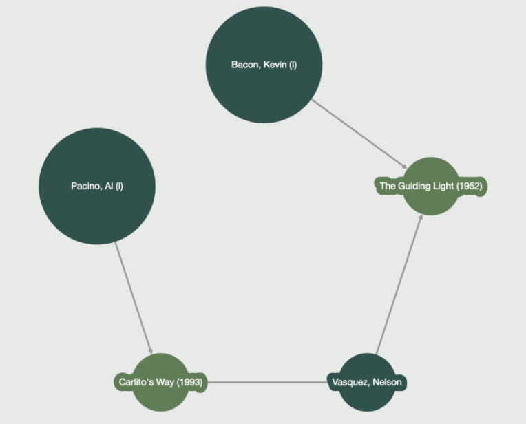

# Orcacle of Bacon

## Présentation

L'objectif de l'application est de déterminer le degré de séparation entre Kevin Bacon et un acteur donné via ses rôles dans les films.

Par exemple : **Al Pacino**

* **Al Pacino** a joué dans `Carlito’s Way` avec `Nelson Vasquez`
* `Nelson Vasquez` a joué dans `The Guiding Light` avec **Kevin Bacon**



## Les modules
Le projet est réparti en deux modules :

* [Le back end](./oracle-of-bacon-backend) qui gère la logique et la connexion aux différents Data Stores.
* [Le front end](./oracle-of-bacon-frontend) qui expose l'IHM.

## Pour démarrer
Pour lancer le projet démarrez deux terminaux et positionnez-vous dans ce répertoire :
```BASH
cd <path to directory oracle-of-bacon>
```

Dans le premier, lancez le frontend :
```BASH
cd oracle-of-bacon-frontend
npm install
npm run dev
```

Dans le second, lancez le backend :
```BASH
cd oracle-of-bacon-backend
./gradlew run
```

Rendez-vous sur a page http://localhost:8080.

Pour la suite du projet, nous vous conseillons d'importer le backend dans votre IDE/éditeur préféré. Sauf désir de créativité :smiley:, vous n'avez rien à faire dans le front-end.

## Le data set
Les données sont des données qui proviennent de imdb, le dataset est disponible ici : http://bit.ly/imdbdataset

## Votre mission
Le site a été bouchonné (cf `TODO`), vous devez effectuer les tâches suivantes :
* Importer les données dans Neo4J à l'aide de l'outil d'import : [`ìmport-tool`](http://neo4j.com/docs/operations-manual/current/tutorial/import-tool/).
* Implémenter l'Oracle de Bacon à l'aide de Neo4J dans la méthode `com.serli.oracle.of.bacon.repository.Neo4JRepository#getConnectionsToKevinBacon`
* Implémenter la gestion du last 10 search à l'aide de Redis dans la méthode `com.serli.oracle.of.bacon.repository.RedisRepository#getLastTenSearches`
* Importer les données à l'iade de ElasticSearch dans `com.serli.oracle.of.bacon.loader.elasticsearch.CompletionLoader` (les liens suivants pourront vous aider : [search](https://www.elastic.co/guide/en/elasticsearch/reference/current/search.html), [mapping](https://www.elastic.co/guide/en/elasticsearch/reference/current/mapping.html) et [suggest](https://www.elastic.co/guide/en/elasticsearch/reference/current/search-suggesters.html))
* Implémenter la suggestion sur le nom des acteurs dans `com.serli.oracle.of.bacon.repository.ElasticSearchRepository#getActorsSuggests`
* Implémenter la recherche des acteurs par nom à l'aide de MongoDB dans `com.serli.oracle.of.bacon.repository.MongoDbRepository#getActorByName`

L'évaluation de votre travail sera effectuée selon les critères suivants :
* Bon fonctionnement (First make it work)
* Qualité de la solution implémentée (Then make it good)
* Qualité générale de votre code (et de vos commits, il ne faut pas pousser :smiley:)

La livraison de votre travail s'effectue à l'aide d'une pull-request sur le repository https://github.com/nosql-bootcamp/oracle-of-bacon.

<span style="color:red; font-size: 2em;">
**Vous devez commencer par forker le repository https://github.com/nosql-bootcamp/oracle-of-bacon**
</span>
